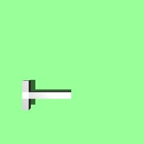
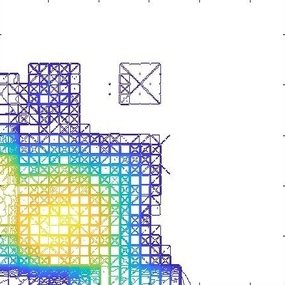
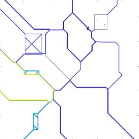
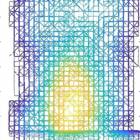
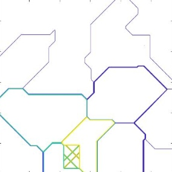
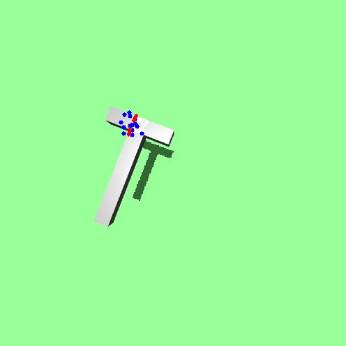
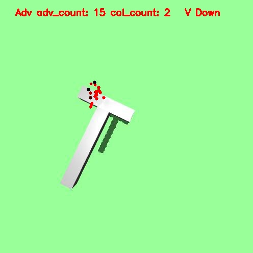

# Robot Learning in Mixed Adversarial and Collaborative Settings IROS









<div>


</div>
  
This project is based on [self-brewed-mujoco-py](https://github.com/davidsonic/self_brewed_mujoco_py) maintained by Seung Hee Yoon, with the following new features added:

1. **Continuous perturbation remapped to discrete circular directions**
2. **New robotic assets included**


## Usage Examples

A number of examples available under examples folder:
- Press `ctrl/shift + mouse` to apply force, will be rendered simultaneously
- [`inverse_kinmatics.py`](./examples/inverse_kinmatics.py): generates an qpos vector, which can be copied to sim.data.ctrl[:] to generate controlling
- robotics and objects: new objects can be added in xmls/Baxter/baxtermaster.xml
- discrete perturbation: 2D plane remapped to N uniformly discretized circular points
- camera and image recording: a new camera named "top_camera_rgb" defined in master.xml, change to camera id 1 to capture grasping images


## Results

- Images captured using newly added camera [`test_kinmatics.py`]: examples/images
- Inverse kinmatic control: examples/videos


## To-do list
1. Refine adversary


## Development

Install grasp environment and self-brewed-mujoco-py:

```
python setup.py build
pip install -e . 
```
Run training:

```
python training/train_init_ik.py
```


## Changelog

- 01/12/2019: Fix force rendering, discretize continuous perturbation, integrate inverse kinmatic control
- 01/17/2019: Fix path planning and grasping bugs, perturb object selected by default. Detector API included.
- 02/01/2019: Before training, environment ready
- 02/05/2019: Training pipeline success
- 02/06/2019: Fix bugs of adv_error, ready to verfy adv policy
- 02/09/2019: Adv verified; User-interface OK;
- 02/10/2019: Update grasping policy, loss in tensorboard
- 02/12/2019: Training protagonist policy complete
- 02/14/2019: Stable version
- 02/16/2019: adv_loss modified
- 02/17/2019: round-nut configuration changed, extract all params outside, 02-17
- 02/18/2019: Logging/plotting feature added, object params fixed
- 02/18/2019: Freeze feature extraction layers of protagonist policy, store all models

## Credits

`Grasping IROS` is maintained by the ICAROS team. Contributors include:

- Jiali Duan
- Qian Wang
- Stefanos Nikolaidis
