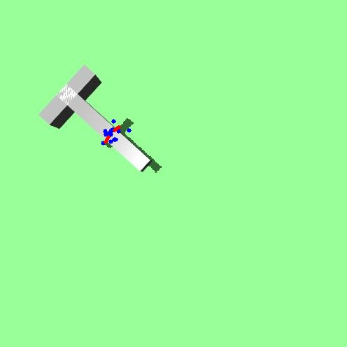
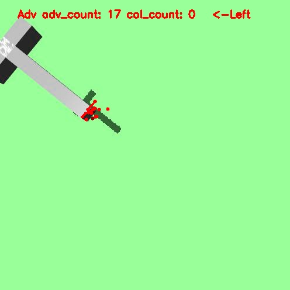
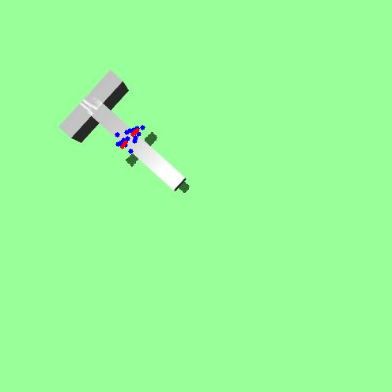
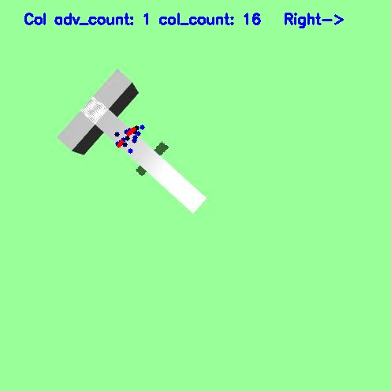

# Robot Learning in Mixed Settings IROS

<div>


  

</div>
  
This project is based on [public grasp IROS](https://github.com/davidsonic/grasp_public) and maintained by Seung Hee Yoon, with the following new features added:

1. **Gneralized force classifier based on the top camera images**
2. **Robot learning framework with the classifier**
2. **Functionality to Capture the ground truth of robustness and sampled robustness**


## Usage Examples

A number of examples available under examples folder:
- Press `ctrl/shift + mouse` to apply force, will be rendered simultaneously
- [`inverse_kinmatics.py`](./examples/inverse_kinmatics.py): generates an qpos vector, which can be copied to sim.data.ctrl[:] to generate controlling
- robotics and objects: new objects can be added in xmls/Baxter/baxtermaster.xml
- discrete perturbation: 2D plane remapped to N uniformly discretized circular points
- camera and image recording: a new camera named "top_camera_rgb" defined in master.xml, change to camera id 1 to capture grasping images


## Results

- Images captured using newly added camera [`test_kinmatics.py`]: examples/images
- Inverse kinmatic control: examples/videos


## Development

Install grasp environment and self-brewed-mujoco-py:

```
python setup.py build
pip install -e . 
```
Run training:

```
python training/train_init_ik.py
```


## Changelog

- 03/07/2019: Uploaded the public source code.

## Credits

`Grasping IROS` is maintained by the ICAROS team. Contributors include:

- Seug Hee Yoon
- Stefanos Nikolaidis
